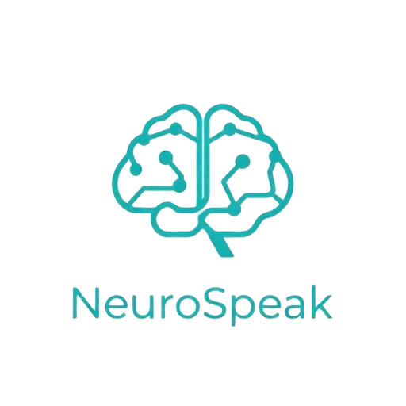
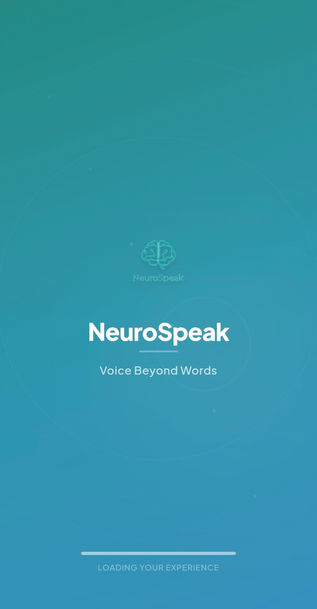
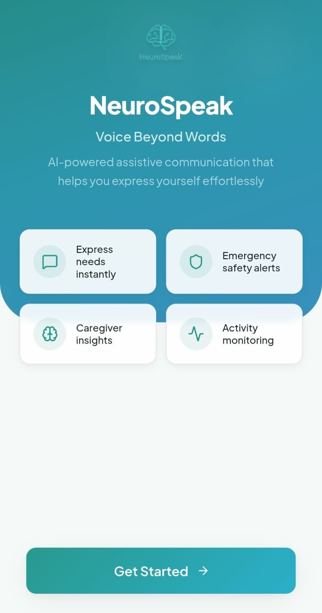

# NeuroSpeak

<table>
<tr>
<td width="55%" valign="top">

## Assistive Communication & Caregiver Support

A mobile-first accessibility platform designed to support
assistive communication, caregiver collaboration, personal safety,
and inclusive digital experiences.

---

  <a href="https://neurospeak-webapp.vercel.app/">
    <strong>🌐 Live Demo →</strong>
  </a>

</td>

<td width="45%" valign="top">

  
  

</td>
</tr>
</table>

---

## ✨ Highlights

| 💬 Communication            | ♿ Accessibility               | 🚨 Safety & Care              | 🛠️ Platform              |
| --------------------------- | ------------------------------ | ----------------------------- | ------------------------ |
| 🗣️ Communication board      | Accessibility-first UI         | 🚨 SOS experience             | ⚛️ React + TypeScript    |
| 🔊 Type-to-Speak            | Adjustable text size           | 📍 Location & safety features | 🗄️ Supabase + PostgreSQL |
| 📝 Custom phrases           | High contrast mode             | 👥 Caregiver workflows        | 📱 Capacitor             |
| 💬 Contact & chat workflows | Mobile-first design            | 🔐 Authentication & RLS       | 🗺️ Leaflet               |
| 📞 Voice & video calling    | Inclusive interaction patterns | 🛡️ Role-based access          | ⚡ Realtime messaging    |

---

## 🛠️ Tech Stack

### Frontend

- React
- TypeScript
- Vite
- Tailwind CSS
- React Router
- Framer Motion

### Backend & Data

- Supabase Authentication
- PostgreSQL
- Row Level Security (RLS)
- Supabase Realtime
- Secure database functions / RPCs

### Mobile

- Capacitor
- Mobile-first responsive architecture

### Maps & Visualization

- Leaflet
- React Leaflet
- Recharts

---

<table>
<tr>

<td width="50%" valign="top">

<h2>🏗️ Architecture</h2>

<pre>
React + TypeScript
        │
        ├── Vite
        │
        └── Capacitor
                │
            Supabase
       ┌────────┼────────┐
      Auth      DB     Realtime
       │        │         │
       │       RLS     Chat Events
       │        │
       └────────┼─────────┐
                │         │
             User      Caregiver
                │         │
        ┌───────┼─────────┤
        │       │         │
      Chat    Safety    Care
</pre>

</td>

<td width="50%" valign="top">

<h2>🔐 Security & Access</h2>

NeuroSpeak uses persistent database-backed roles instead
of trusting the role selected by the client.

### Access model

- 👤 User accounts
- 👥 Caregiver accounts
- 🔒 Role-based route protection
- 🛡️ Supabase Row Level Security
- 🔐 Database-backed role persistence
- 🚫 Client-side role changes prevented
- 🔑 Supabase Auth for authentication

The application resolves the authenticated user's role
from the `profiles` table before granting access to
role-specific areas.

</td>

</tr>
</table>

---

## 💬 Communication

NeuroSpeak provides an assistive communication experience
designed for users who may have difficulty communicating
through conventional interfaces.

### Features

- 🗣️ Communication board
- 🔊 Type-to-Speak
- 📝 Custom phrases
- 💬 Contact discovery
- 🤝 Connection requests
- 💬 Persistent one-to-one messaging
- ⚡ Realtime message updates
- 📞 Voice calling
- 📹 Video calling
- 💡 Quick communication phrases

Chat communication uses a dedicated backend model with
connection requests, conversations, messages, database
functions, and realtime updates.

---

## 👥 Caregiver Support

Caregivers have a dedicated role and interface for supporting
connected users.

The platform separates caregiver workflows from regular
user access through persistent database roles and protected
application routes.

---

## 🚨 Safety & Care

NeuroSpeak includes safety-oriented functionality to support
users and their caregivers.

- 🚨 SOS experience
- 📍 Location-related safety features
- 🛡️ Safe zones
- 🔔 Alerts and notifications
- 👤 Emergency contact workflows
- 👥 Caregiver-patient relationships

---

## ♿ Accessibility

Accessibility is a core design requirement rather than an
additional layer.

The interface includes:

- Adjustable text sizing
- High contrast support
- Large, touch-friendly interactions
- Mobile-first layouts
- Clear navigation
- Communication-focused UI
- Reduced interaction complexity

---

## 🗄️ Database Architecture

The application uses PostgreSQL through Supabase.

Core data areas include:

- `profiles`
- `caregiver_patient`
- `emergency_contacts`
- `conversations`
- `messages`
- `notifications`
- `sos_events`
- `alerts`
- `live_locations`
- `safe_zones`
- `app_settings`

Communication also uses dedicated chat tables:

- `connection_requests`
- `chat_conversations`
- `chat_messages`

Row Level Security policies control access to user,
caregiver, safety, and communication data.

---
